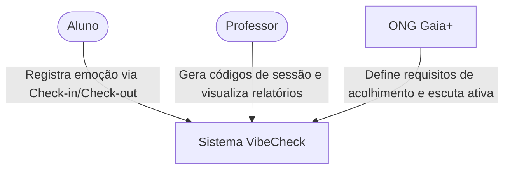
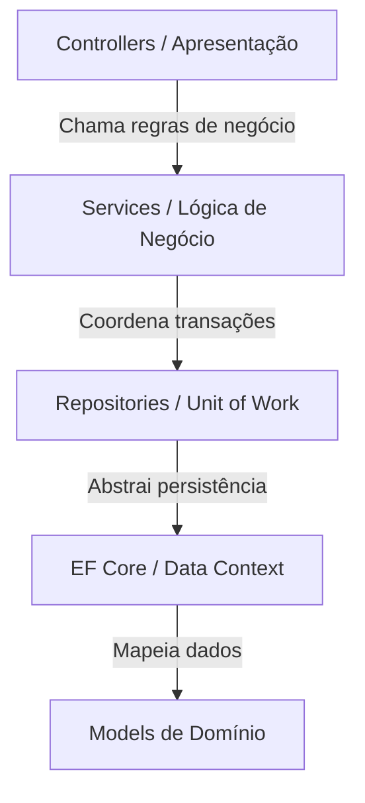
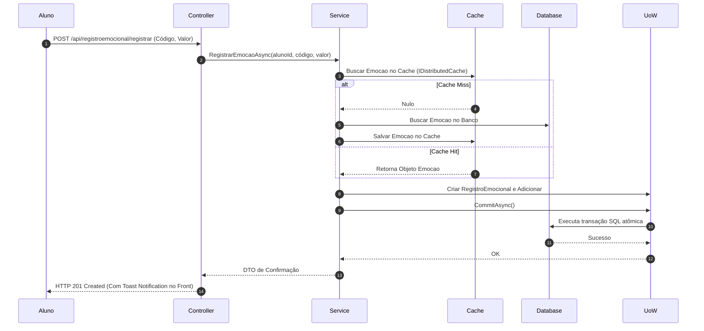

# Documentação de Arquitetura de Software — Modelo arc42
## Projeto VibeCheck 🎯

Esta documentação descreve a arquitetura do sistema **VibeCheck**, estruturada com base no modelo **arc42**, focando na modularidade, escalabilidade e qualidade de software.

---

## 1. Introdução e Objetivos

O **VibeCheck** é um sistema web projetado para o monitoramento emocional de alunos durante práticas de bem-estar (como atividades musicais). O sistema visa compreender o estado emocional dos estudantes no início e no fim das atividades, registrando os dados de forma **anônima, simples e visual** através de emojis.

### 1.1. Visão Geral dos Requisitos

*   **Registro Emocional (Check-in/Check-out):** O aluno registra seu estado emocional no início e no fim da aula usando emojis.
*   **Controle de Sessão:** O professor gera códigos de acesso temporários para liberar o registro emocional dos alunos durante o período da aula.
*   **Visualização de Dados:** O professor visualiza relatórios e gráficos consolidados por aluno e por turma, com filtros.
*   **Autonomia do Aluno:** O aluno acessa seu histórico emocional privado e recursos de autorregulação (como sugestões de vídeos e músicas).
*   **Requisitos Não Funcionais:** Interface amigável e intuitiva, alta performance com tempo de resposta rápido, compatibilidade responsiva com dispositivos móveis e segurança de dados.

### 1.2. Objetivos de Qualidade

| Objetivo | Métrica/Meta Mensurável | Contexto |
| :--- | :--- | :--- |
| **Disponibilidade** | `99.99%` de sucesso lógico na operação de Registro de Emoção. | Eliminar falhas por concorrência em picos de alta frequência de check-in/out. |
| **Performance** | Latência `P95 < 100ms` para a gravação do Registro de Emoção. | Otimizado via caching e consultas assíncronas no banco de dados. |
| **Segurança** | Zero ocorrências de SQL Injection. | Acesso a dados 100% mediado pelo ORM Entity Framework Core com parâmetros automáticos. |
| **Escalabilidade** | Suportar `10x` mais usuários simultâneos com a mesma infraestrutura. | Preparar o sistema para crescimento contínuo de turmas sem refatoração de código. |
| **Usabilidade** | Navegação fluida e feedbacks imediatos via Toast Notifications. | Reduzir a curva de aprendizado e aumentar a retenção dos usuários. |

---

## 2. Restrições Arquiteturais

| Categoria | Restrição | Impacto no Design |
| :--- | :--- | :--- |
| **Tecnologia Principal** | API construída em **ASP.NET Core 8 (.NET 8)**. | Decisão estratégica de migração do código Java legado para melhorias de performance e redução de consumo de recursos. |
| **Persistência de Dados** | Compatibilidade obrigatória com **PostgreSQL** (padrão) e flexibilidade para rodar em **SQL Server**. | Implementação de uma estrutura de *Database Adapter* no `Program.cs` para alternar SGBDs por variáveis de ambiente. |
| **Padrões de Design** | Adoção de **Repository Pattern** + **Unit of Work (UoW)**. | Abstração da lógica de persistência e garantia de transações atômicas e seguras. |
| **Usabilidade / Acessibilidade** | Layout responsivo seguindo padrões básicos das diretrizes **WCAG**. | Interface adaptável a celulares, tablets e computadores, garantindo acessibilidade a todos os alunos. |

---

## 3. Contexto e Escopo

### 3.1. Contexto Negocial

*   **Professor:** Atua como usuário administrativo. Ele inicia as sessões de monitoramento (gerando os códigos de acesso) e consome os dashboards visuais para ajustar sua abordagem pedagógica de bem-estar.
*   **Aluno:** Atua como usuário final. Ele é o fornecedor primário dos dados emocionais, interagindo com o sistema de forma rápida e anônima.
*   **ONG Gaia+:** Parceira estratégica do projeto que apoia a definição de requisitos de acolhimento no ambiente escolar.

### 3.2. Contexto Técnico e Mapeamento de Canais

*   **Cliente Web/Mobile:** Comunicação assíncrona/síncrona via protocolo **HTTP/HTTPS** utilizando JSON (DTOs).
*   **Autenticação:** Integrada de forma segura com **Google OAuth 2.0** para registro de usuários utilizando `GoogleId` e claims de email.
*   **Acesso a Dados:** Realizado com **Entity Framework Core 8** mapeando modelos em PostgreSQL ou SQL Server.
*   **Caching:** Uso de cache distribuído (**IDistributedCache** / Redis) para armazenar dados estáticos de alta leitura (como o catálogo de emoções).
*   **Testes de Carga:** Validação executada via ferramenta **k6** simulando acessos de usuários virtuais concorrentes.

---

## 4. Estratégia de Solução

Para cumprir os objetivos de qualidade estabelecidos, foram adotadas as seguintes decisões fundamentais:

1.  **Migração para .NET 8:** A substituição da plataforma Java legada pelo runtime do .NET 8 reduziu o tempo de startup em até 80% e o uso de memória em 60%, aumentando significativamente o throughput da aplicação.
2.  **Caching da Entidade Emocao:** O catálogo de emoções é carregado do cache (Redis/MemoryCache), mitigando idas desnecessárias ao banco de dados e derrubando a latência de busca para menos de `35ms`.
3.  **Table-Per-Hierarchy (TPH):** Mapeamento de herança para usuários (Usuario, Aluno, Professor) em uma única tabela física no banco. Isso simplifica o esquema e otimiza consultas de junção.
4.  **AsNoTracking para Consultas de Leitura:** Em endpoints que retornam dados sem intenção de modificação (como relatórios e listagens), o EF Core não rastreia alterações nas entidades, economizando de 40% a 60% de memória em runtime.

---

## 5. Visão de Blocos de Construção (Arquitetura em Camadas)

A decomposição lógica do backend VibeCheck é estruturada sob a **Separation of Concerns (Separação de Conceitos)**:

### 5.1. Componentes do Sistema

*   **Controllers (`Controllers/`):** Camada de apresentação HTTP. Recebe requisições, valida inputs básicos, autoriza claims e expõe retornos baseados em `IActionResult`.
*   **Services (`Services/`):** Camada de regras de negócio. Orquestra a lógica de domínio e coordena o uso de repositórios e Unit of Work.
*   **Repositories / Unit of Work (`Repositories/`):** Abstrai as operações de escrita e leitura de banco de dados (`IRepository<T>`) e gerencia a atomicidade das transações (`IUnitOfWork.CommitAsync()`).
*   **Data / Context (`Data/Context/`):** Configurações do Entity Framework Core, DbSets e mapeamento relacional. Contém também o `IDatabaseAdapter` para flexibilidade de SGBDs.
*   **Models (`models/`):** Entidades de domínio (Aluno, Professor, Emocao, RegistroEmocional, Turma).

---

## 6. Visão de Tempo de Execução

### Cenário 1: Fluxo Crítico de Escrita (Registro Emocional do Aluno)

O aluno envia o código de acesso e seu registro emocional. A Unit of Work garante que o registro seja gravado e as estatísticas da turma/aluno sejam mantidas de forma atômica (ACID):

---

## 7. Visão de Implantação

A infraestrutura de produção foi projetada para alta disponibilidade e suporte a escalabilidade horizontal:

*   **Load Balancer:** Distribui as requisições HTTP entre múltiplas instâncias idênticas do container da API do VibeCheck.
*   **Instâncias da API:** Rodam de forma *stateless* em containers Docker independentes.
*   **Banco de Dados Relacional:** Banco PostgreSQL centralizado com volumes persistentes de dados.
*   **Serviço de Cache:** Redis compartilhado para manter os caches de entidades estáticas e dados de sessão distribuídos.

---

## 8. Conceitos Transversais

*   **Segurança e Autenticação:** A autenticação é delegada ao Google OAuth 2.0. As permissões são validadas com base em Roles (`ROLE_PROFESSOR` e `ROLE_ALUNO`), configuradas de forma programática através de policies do ASP.NET Core no `Program.cs`.
*   **Acesso Transacional:** Garantido pelo padrão Unit of Work. Nenhuma gravação isolada chega ao banco de dados sem passar por um escopo transacional completo.
*   **Logging Estruturado:** Logs gerados de forma padronizada em formato JSON pelo framework **Serilog**, simplificando a depuração e monitoramento em ambientes de produção.

---

## 9. Decisões Arquiteturais (ADRs)

*   **ADR-001 (Migração Java -> .NET 8):** Decisão aceita. A migração permitiu ganho de desempenho crítico nas respostas da API de registro.
*   **ADR-002 (EF Core & Repository/UoW):** Decisão aceita. Padronização e encapsulamento total do acesso a dados, reduzindo redundâncias de escrita e tratando de forma nativa SQL Injection.
*   **ADR-003 (Caching Distribuído):** Decisão aceita. Implementação do cache de emoções e dados de sessões para diminuir a carga sobre o banco de dados principal.

---

## 10. Riscos e Débitos Técnicos (TDRs)

1.  **TDR 1 — Uso Residual de SQL Bruto:** Embora o EF Core seja o padrão do projeto, deve-se auditar e evitar o uso de métodos como `FromSqlRaw` que burlam a parametrização nativa e podem expor brechas de segurança.
2.  **TDR 2 — Dependência de Cache:** A arquitetura depende fortemente do caching para bater as metas de latência. Em caso de falha física do Redis em produção, o sistema deve possuir políticas de *circuit breaker* para redirecionar as chamadas ao banco direto, com degradação aceitável de velocidade.
3.  **TDR 3 — Crescimento Exponencial de Dados:** Com o uso frequente, a tabela de registros emocionais tende a crescer exponencialmente. Recomenda-se a adoção de estratégias de arquivamento histórico ou banco secundário de leitura de dados consolidados a longo prazo.

---

## 11. Glossário

*   **arc42:** Template alemão de documentação de arquitetura de software focada no pragmatismo.
*   **AsNoTracking:** Recurso de otimização de leitura do Entity Framework Core que economiza memória de runtime.
*   **Eager Loading:** Técnica de carregamento antecipado de tabelas correlacionadas em um único comando SQL, mitigando o gargalo de performance conhecido como problema N+1.
*   **TPH (Table-Per-Hierarchy):** Abordagem de modelagem de banco de dados onde subclasses compartilham a mesma tabela física diferenciadas por uma coluna discriminadora.
*   **UoW (Unit of Work):** Padrão de design que gerencia transações atômicas de negócio em banco de dados.
